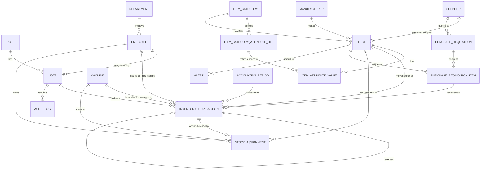

<!-- title: Ameya Tool Inventory — Phase 1 -->

# Ameya Precision Engineers — Production Tool & Consumable Inventory System
## Phase 1: Requirements, Excel Analysis & Architecture Proposal

*Prepared from analysis of `INSERT CONSUMPTION SHEET JUN-2026.xlsx`, `JAN-DEC-2026.xlsx`, and `PURCHASE REQUISTION SLIP-MAY-2026.xls`. No code has been written yet — this document is for review and sign-off before Phase 2 (database design) begins.*

---

## A. Understanding of the Current Excel Process

Three separate, unlinked workbooks currently run production inventory. Each was inspected sheet-by-sheet, cell-by-cell.

### A.1 `INSERT CONSUMPTION SHEET JUN-2026.xlsx` — the tool consumption ledger

One workbook **per month**, three tabs: **INSERT**, **DRILLS**, **TAPS**. Structure (identical across tabs):

| Region | Columns | Meaning |
|---|---|---|
| Identity | `No.`, `INSERT No.` (item code/description), `Make`, `Category` (D col, e.g. MILLING/GROOVE/DRILLING) | Item identity, free text |
| Stock-in block | `NEW STOCK-MAY.2024`, `RUNNING STOCK`, `NEW ADD.IN STOCK` | Opening balances carried forward + in-month additions |
| `OPENING STOCK` | Computed sum of the stock-in block | Month's starting quantity |
| Daily grid | Columns `1`–`31` | Quantity **consumed** on that calendar day (no unit price, no employee, no machine — just a number) |
| `USED STOCK` | Sum of the daily grid | Total consumed this month |
| `BAL. STOCK` | Opening − Used | Closing balance |
| `TOTAL USED IN MONTH`, `PRICE PER INSERT`, `TOTAL COST` | Tail columns | Consumption value at **current** unit price |

Findings from the live June 2026 data:
- **338 active insert items**, **211 active drill items**, **122 active tap items** are tracked with real usage this month; the rest of each tab's rows are pre-printed size/diameter placeholders (e.g. every HSS drill diameter from Ø0.50 to Ø anything) waiting for stock to exist.
- A footer computes `TOTAL INSERT CONSUMPTION` (₹7,11,746 for June) and a manually curated "MOSTLY USE" top-items list — i.e. **management already wants a Top-N high-usage report**, currently built by hand.
- **No employee, no CNC/machine, no reason/remark is captured anywhere in this file.** A "10" in day-column N just means *ten pieces left the store that day* — issued to whom, for which machine, is not recorded. This is the single biggest accountability gap the new system must close.
- Manufacturer names are free text and inconsistent: `ISCAR` / `ISKAR` / `ISKSR`, `ACHTECK` / `ACKTECH`, `KINTECH` / `KINTECK`, `SECO` / `SECO ` (trailing space) all appear as distinct values. A Manufacturer master with enforced selection is a direct fix.
- Item identity is the free-text description itself (e.g. `XOMX 120404 TR-ME08 F40M`) — there is no stable item code, so the same physical tool purchased from two suppliers can silently become two "different" rows (confirmed again in the Purchase file, see A.3).

### A.2 `JAN-DEC-2026.xlsx` — the machine-wise oil/consumable log

One sheet per month (Jan–May 2026 populated so far). Each sheet has **two unrelated tables**:

1. **Machine-wise oil table** (rows 3–22): 19 machines/work-centers (`CNC-1` … `CNC-9`, `VMC-1/3/4/5`, `VTL-1/2/3`, `GRINDING-1/2`, `CTM`, `CUTTING SHOP & MACHINE SHOP`) each with a monthly **Cutting Oil**, **Hydraulic Oil**, and **Machine Oil** consumption figure in litres, plus a computed `TOTAL` litres column. This is the *only* place in all three files where consumption is already machine-attributed — but only at monthly-total granularity (no date, no who topped it up).
2. **General consumables table** (rows 24–38, same sheet): a second, item-wise stock ledger for shop-floor consumables (files, emery/lapping paper, buffing pads, hand tools) with `USED THIS MONTH`, `PRICE`, `ADDED IN MONTH`, `OLD STOCK`, `BAL. STOCK`, `TOTAL` (value) columns — structurally identical in spirit to the INSERT sheet but **not** machine-attributed.

This confirms oils/coolants and general consumables are being tracked as two more parallel, disconnected mini-ledgers with the same weaknesses as A.1.

### A.3 `PURCHASE REQUISTION SLIP-MAY-2026.xls` — purchasing

One workbook **per month**, structured as:
- One sheet **per requisition slip** (`O0017`, `0018` … `0033` for May, plus a legacy `055` from FY2024-25 left in the workbook). Each slip has a fixed header block (`TO: PURCHASE`, `FROM: PRODUCTION`, `SLIP NO.`, `DATE`, a reference number that is sometimes a courier/challan number, sometimes a quote number, sometimes just the date again) and a line-item table: description, requisitioned qty, date, supplier (free text, "if known"), unit amount, gross total, discount %, net amount after discount.
- `Sheet1`: a **consolidated master log** of 71 rows that appears to aggregate received purchases across slips/months, adding `RECEIVED Qty`, `BAL. STOCK`, `USE ON SHOP FLOOR`, and `TOTAL CONSUMPTION` columns not present on the individual slips.

Findings:
- **No approval workflow or status field exists** — a slip is just a printed form; there's no DRAFT/APPROVED/ORDERED/RECEIVED state machine, no requester name (only department = "PRODUCTION"), no PR-to-GRN linkage beyond the row being copied into `Sheet1` by hand.
- Dates are stored as raw Excel serial numbers (e.g. `46146`) — a formatting/import concern, not a business one, but must be handled explicitly during migration.
- The same physical item is purchased from different suppliers at different prices in the same month with no shared item code (e.g. `VBMT160404 PC9030` bought from both MAHATOOLS SALES @ ₹450 and NBS ENTERPRISES @ ₹475 within days of each other) — reinforcing the need for a real Item Master decoupled from supplier-quoted descriptions.
- The `USE ON SHOP FLOOR` / `TOTAL CONSUMPTION` columns on some rows show that goods are sometimes issued directly from the goods-received point straight to the floor, bypassing a formal "into store, then issued" step. This is a real operational pattern the new system should accommodate (see §21 Purchase workflow) rather than force everything through a rigid two-step dance.
- Discount is applied inconsistently — some rows carry a discount %, most don't — so **landed unit cost, not the quoted "AMOUNT UNIT", is the true cost to capture** on inward transactions.

### A.4 Cross-file inconsistencies to resolve deliberately (not silently)

| # | Issue | Where | Resolution proposed |
|---|---|---|---|
| 1 | No stable item code — identity is free-text description | All 3 files | New Item Master issues a system Item Code at creation; legacy description stored as `legacy_description` for traceability during migration |
| 2 | No employee/machine on individual issue transactions | INSERT sheet | Cannot be reconstructed. Historical daily-consumption rows import as `ISSUE_OUTWARD` transactions with `source = LEGACY_IMPORT` and employee/machine left `NULL` — never invented (see §29 of your brief, honored) |
| 3 | Oil consumption is machine-attributed but only as a monthly total, no daily transactions | JAN-DEC sheet | Import as one `ISSUE_OUTWARD` transaction per machine per month, dated the last day of that month, tagged `LEGACY_IMPORT` |
| 4 | Manufacturer/supplier names are inconsistent free text | INSERT sheet, Purchase file | Manufacturer & Supplier masters created from the distinct-value list found in Excel; Admin merges spelling variants during import review (see §29 preview/dedupe step) |
| 5 | Ambiguous "stock-in" block (`NEW STOCK-MAY.2024` / `RUNNING STOCK` / blank sub-column) on the INSERT sheet | INSERT sheet | **Open question — see §J.1.** Proposed default: treat the sum as a single `OPENING_BALANCE` transaction per item at first import; do not try to preserve the internal split. |
| 6 | Purchase Requisition has no status/approval trail | Purchase file | New PR module adds the missing state machine going forward; historical slips import as `RECEIVED`/`CLOSED` with today's data only (no retroactive approval history exists to import) |

---

## B. Recommended Future Workflow

```
Production floor needs a tool
        │
        ▼
Issuer looks up item → sees live stock, safe stock, unit cost
        │
        ▼
ISSUE transaction: qty, employee, machine, purpose, remark
        │                                   │
        ▼                                   ▼
Stock ledger decrements automatically   Assignment record opens
        │                                   │
        ▼                                   ▼
Tool used on machine ──────────► Returned (good/damaged/scrap)
                                            │
                                            ▼
                                  Stock ledger updated again,
                                  assignment closed/reduced

Meanwhile, independently:
Low stock detected → Alert raised → Admin/Store raises Purchase
Requisition → Approved → Ordered → Goods received → PURCHASE_INWARD
transaction → stock increases (never before receipt)
```

Every arrow above is a **transaction row**, not a field update. Monthly/CNC/valuation reports are queries over that ledger, never hand-maintained totals.

---

## C. Complete Module List

1. **Auth & Users** — login, roles, password reset, session
2. **Masters** — Items, Tool Categories (+ configurable category attributes), Manufacturers, Suppliers, Machines/CNC, Employees, Units of Measure
3. **Inventory Transaction Engine** — the ledger; all stock movement types
4. **Issue / Outward** — the Issuer's primary daily screen
5. **Return** — good/damaged/scrap returns against an open assignment
6. **Stock Adjustment** — Admin-only, reasoned in/out corrections
7. **Accountability** — currently-assigned tools, by employee and by machine
8. **CNC / Machine Consumption** — machine-wise reporting
9. **Alerts** — low stock, out of stock, pending return, high consumption
10. **Purchase Requisition & Inward** — PR lifecycle → goods receipt → stock
11. **Suppliers/Dealers** — master + purchase history per supplier
12. **Dashboard** — KPIs + charts
13. **Reports** — inventory, consumption, accountability, purchase (Excel/PDF export)
14. **Excel Import (Legacy Migration)** — one-time, admin-driven, with preview/validation
15. **Audit Log** — system-wide, append-only
16. **Month-End Closing** (architected now, simple in V1) — lock a period
17. **Global Search** — item/employee/machine/transaction lookup
18. **Settings/Administration** — categories, thresholds, system config

---

## D. User-Role Permission Matrix

| Module / Action | Admin | Issuer / Store | Viewer / Management (future) |
|---|:---:|:---:|:---:|
| Dashboard, Alerts (read) | ✅ | ✅ | ✅ |
| Item/Machine/Employee masters — view | ✅ | ✅ | ✅ |
| Item/Machine/Employee masters — create/edit | ✅ | ❌ | ❌ |
| Category, Manufacturer, Supplier masters | ✅ | ❌ | ❌ |
| Set Safe Stock / Max Stock | ✅ | ❌ | ❌ |
| Issue (Outward) | ✅ (as fallback) | ✅ | ❌ |
| Return | ✅ (as fallback) | ✅ | ❌ |
| Purchase Inward (goods receipt) | ✅ | ✅ (if delegated) | ❌ |
| Stock Adjustment | ✅ | ❌ | ❌ |
| Purchase Requisition — create | ✅ | ✅ | ❌ |
| Purchase Requisition — approve | ✅ | ❌ | ❌ |
| Transaction history — view | ✅ | ✅ | ✅ |
| Reports — view | ✅ | ✅ | ✅ |
| Reports — export | ✅ | ✅ | ✅ |
| Excel import | ✅ | ❌ | ❌ |
| Audit log | ✅ | ❌ | ❌ |
| User management | ✅ | ❌ | ❌ |
| Month-end close | ✅ | ❌ | ❌ |

Enforced with Spring Security method-level `@PreAuthorize` on every service method (not just controller routes), so the rule holds even if a new controller is added later.

---

## E. Database ER Design (entities & relationships)

Full DDL is a Phase 2 deliverable; this is the entity model the schema will implement.



**Core tables and purpose:**

| Table | Purpose | Key fields worth calling out |
|---|---|---|
| `roles`, `permissions`, `role_permissions` | RBAC, extensible beyond the initial 3 roles | code, description |
| `users` | Login identity | username, password_hash, employee_id (nullable), role_id, active |
| `employees` | People, whether or not they log in | employee_code, name, department_id, active |
| `departments` | Org grouping | name |
| `machines` | CNC/VMC/VTL/Grinding/etc. | machine_code, machine_type, department_id, active |
| `units_of_measure` | PCS, LTR, SET, PKT... | code, name |
| `manufacturers` | Normalized make list | name (unique, case-insensitive) |
| `suppliers` | Dealer master | name, gst_no, contact, active |
| `item_categories` | Admin-configurable, not hard-coded | name, parent_category_id (for sub-categories), active |
| `item_category_attribute_defs` | *Which* extra fields a category needs (diameter, grade, pitch...) and their data type | category_id, attribute_name, data_type, is_required |
| `items` | The master record | item_code (unique), name, category_id, manufacturer_id, preferred_supplier_id, uom_id, safe_stock, max_stock, current_unit_cost (denormalized cache only — see §G.3), active |
| `item_attribute_values` | EAV values keyed to a definition, per item | item_id, attribute_def_id, value |
| `inventory_transactions` | **The ledger — immutable** | txn_no, item_id, txn_type, quantity (signed), unit_cost_at_txn, machine_id (nullable), employee_id (nullable), performed_by_user_id, purpose, remark, reversal_of_txn_id (nullable), source (`APP`/`LEGACY_IMPORT`), txn_date, created_at |
| `stock_assignments` | Live "who has what" view, derived from but cached alongside the ledger for fast querying | item_id, employee_id, machine_id, assigned_qty, returned_qty, status (`ASSIGNED`/`PARTIALLY_RETURNED`/`CLOSED`), opened_by_txn_id |
| `purchase_requisitions` | PR header | pr_no, requested_by_user_id, department_id, status, priority, created_at |
| `purchase_requisition_items` | PR lines | pr_id, item_id, quantity, estimated_price, supplier_id, received_txn_id (nullable until GRN) |
| `alerts` | Alert center | type, item_id (nullable), message, status (`OPEN`/`ACKNOWLEDGED`/`RESOLVED`), raised_at |
| `audit_logs` | Every mutating action | user_id, action, module, entity, entity_id, old_value (JSON), new_value (JSON), ip, created_at |
| `accounting_periods` | Month-end closing | period (e.g. 2026-06), status (`OPEN`/`CLOSED`), closed_by, closed_at |

**Why EAV (`item_category_attribute_defs` + `item_attribute_values`) over a JSON column:** your brief explicitly asks that categories and their attributes be Admin-configurable, not hard-coded. A JSON blob on `items` is simpler to build but isn't self-describing — Admin can't manage "what fields does DRILL need" through a UI without touching code. The EAV pair keeps that fully data-driven at a modest query-complexity cost, which is worth it for a system meant to outlive its first category list. This is flagged again as a decision point in §J.

---

## F. Excel → Database Mapping

### F.1 `INSERT CONSUMPTION SHEET JUN-2026.xlsx` (INSERT / DRILLS / TAPS tabs, structurally identical)

| Excel column | Target table.field | Notes |
|---|---|---|
| `No.` | *(discarded)* | Row sequence only, not a stable identifier |
| `INSERT No.` (description) | `items.name` (+ `items.legacy_description` on first import) | Becomes the lookup key for de-duplication during import |
| `Make` | `manufacturers.name` → `items.manufacturer_id` | Free-text variants merged during import review (see A.4 #4) |
| Category column (D, e.g. MILLING/GROOVE) | `item_categories.name` (sub-category) or `item_category_attribute_defs` value | **Open question — see §J.2**: is this a true sub-category or an attribute (application type)? |
| `NEW STOCK-MAY.2024` + `RUNNING STOCK` + blank sub-col | Single `inventory_transactions` row, `txn_type = OPENING_BALANCE`, `txn_date` = first day of first imported month | See A.4 #5 |
| `NEW ADD.IN STOCK` | `inventory_transactions`, `txn_type = STOCK_ADJUSTMENT_IN`, remark = "Legacy: new stock added mid-period" | Only where historical detail is unavailable at day-level |
| Daily grid (cols `1`–`31`) | One `inventory_transactions` row per non-empty day, `txn_type = ISSUE_OUTWARD`, `quantity` = cell value (negative in ledger convention), `employee_id = NULL`, `machine_id = NULL`, `source = LEGACY_IMPORT` | The core of the migration — see §29 rule, honored: nothing invented |
| `OPENING STOCK`, `BAL. STOCK`, `USED STOCK` | *(not stored — recomputed)* | Used only to **validate** the import: sum of imported transactions must reconcile to these printed totals, or the row is flagged as an import error |
| `PRICE PER INSERT` | `inventory_transactions.unit_cost_at_txn` for that month's transactions (not `items.current_unit_cost`, which only reflects the latest known price) | Preserves historical cost per §35 of your brief |
| `TOTAL USED IN MONTH`, `TOTAL COST` | *(not stored — recomputed)*, used for reconciliation only | |

### F.2 `JAN-DEC-2026.xlsx`

| Excel region | Target table.field | Notes |
|---|---|---|
| Sheet name / `A1` (`JAN.--2026`) | `inventory_transactions.txn_date` (month) | |
| `M/C NAME & No.` | `machines.machine_code` (create if missing) | Machine master seeded directly from this list |
| `CUTTING OIL`, `HYDROLIC OIL`, `MACHINE OIL` (per machine) | One `inventory_transactions` row per machine per oil-type per month, `txn_type = ISSUE_OUTWARD`, `item_id` = matching Oil item, `machine_id` set, `employee_id = NULL`, `source = LEGACY_IMPORT`, dated last day of month | This is the *only* legacy data that carries machine attribution — imported with `machine_id` populated, unlike F.1 |
| Second table: `WIER FILE FLAT`, `FINE PAPER`, etc. (rows 24+) | Treated exactly like F.1's daily-grid logic but at monthly granularity: one `ISSUE_OUTWARD` transaction per item per month | These become ordinary `items` under category `OTHER CONSUMABLES` |
| `PRIZE` (price) column | `inventory_transactions.unit_cost_at_txn` | |

### F.3 `PURCHASE REQUISTION SLIP-MAY-2026.xls`

| Excel column | Target table.field | Notes |
|---|---|---|
| Sheet name (`0017`...) / `SLIP NO:-` | `purchase_requisitions.pr_no` | |
| `DATE` (Excel serial) | `purchase_requisitions.created_at` | Serial-to-date conversion handled explicitly in the importer, not left to spreadsheet formatting |
| `FROM: PRODUCTION` | `purchase_requisitions.department_id` | No requester name exists in the source — `requested_by_user_id` imports as a designated "Legacy Import" system user, not invented |
| Line: `DESCRIPTION`, `Req. QTY`, `AMOUNT UNIT`, `SUPPLER` | `purchase_requisition_items` (item resolved/created via the same de-dup logic as F.1), quantity, estimated_price, supplier_id | |
| `GROSS`, `DISCOUNT`, `WITH DISCOUNT` | `purchase_requisition_items.estimated_price` = **with-discount** unit price (landed cost), discount % kept as a note | Per A.3, discount-adjusted price is the true cost |
| `Sheet1`: `RECIVED Qty`, `DATE` | `inventory_transactions`, `txn_type = PURCHASE_INWARD`, linked back to the matching `purchase_requisition_items.received_txn_id` where a slip match can be made; otherwise imported as a standalone inward transaction | Reconciling `Sheet1` rows to individual slips is done by (description + date + supplier) match during the import preview — ambiguous matches are surfaced to Admin, never auto-guessed |
| `USE ON SHOP FLOOR`, `TOTAL CONSUMPTION` | Additional `ISSUE_OUTWARD` transaction immediately following the `PURCHASE_INWARD`, same quantity, remark "Direct-to-floor issue at receipt (legacy)" | Preserves the real operational pattern found in A.3 instead of forcing it into a shape it didn't have |

---

## G. Inventory Transaction Rules

### G.1 Stock formula (authoritative, per item)

```
current_stock =
    Σ OPENING_BALANCE
  + Σ PURCHASE_INWARD
  + Σ RETURN_FROM_USER (condition = GOOD)
  + Σ STOCK_ADJUSTMENT_IN
  + Σ TRANSFER_IN
  − Σ ISSUE_OUTWARD
  − Σ DAMAGE
  − Σ SCRAP
  − Σ STOCK_ADJUSTMENT_OUT
  − Σ TRANSFER_OUT
  ± Σ REVERSAL (sign matches the transaction it reverses)
```

`current_stock` is **never written directly**. It is either computed on read (materialized view / indexed query over `inventory_transactions`, filtered by item) or maintained as a cached, trigger-free running total updated *only* inside the same DB transaction that inserts the ledger row — recomputed nightly against the ledger as a integrity check either way.

### G.2 Concurrency control

Two issuers requesting the last 10 units simultaneously must not both succeed. Implementation: each `ISSUE_OUTWARD` (and `STOCK_ADJUSTMENT_OUT`/`DAMAGE`/`SCRAP`) request runs inside a DB transaction that takes a **pessimistic row lock** (`SELECT ... FOR UPDATE`) on the item's stock-summary row, re-validates `quantity <= available_stock` *inside* the lock, inserts the ledger row, and commits. Optimistic locking (version column) is used on master-data edits (price, safe stock) where lost-update risk is low and blocking isn't worth it; issue/outward specifically needs pessimistic locking because the cost of a race (negative stock reaching the shop floor) is high.

### G.3 Valuation method — recommendation: **Weighted Average Cost**

Three options exist: latest master price, FIFO (lot-tracked), weighted average.
- **Latest master price** is explicitly rejected by your brief (§35) — it would retroactively change historical consumption value.
- **FIFO** requires lot/batch tracking. Nothing in the source data tracks tools by purchase lot (drills and inserts of the same spec are fungible, not serialized), so FIFO would add real complexity — receiving/consuming lot IDs, partial-lot issue logic — with no data to back it.
- **Weighted Average** recomputes `items.current_unit_cost` on every `PURCHASE_INWARD` (`new_avg = (old_qty×old_avg + new_qty×new_price) / (old_qty+new_qty)`), and **every transaction stores its own `unit_cost_at_txn` snapshot** at the moment it's created. A June `ISSUE_OUTWARD` keeps June's average cost forever, even if the item is repriced in July. This satisfies the historical-integrity requirement without lot-tracking overhead, and matches how the item is actually used on the shop floor (interchangeable, not individually tracked).
- Architecture keeps this pluggable: valuation logic lives behind a `ValuationStrategy` service interface so FIFO could be added per-category later without touching the ledger schema.

### G.4 Historical-transaction immutability

No `UPDATE` is ever issued against a posted `inventory_transactions` row. Corrections are always a new `REVERSAL` transaction (full offset) optionally followed by a corrected transaction, both linked via `reversal_of_txn_id`, both audit-logged, both requiring a reason. Once an `accounting_period` is `CLOSED`, the service layer rejects new transactions dated inside that period outright (not just discourages them).

---

## H. Reporting Design

All reports are **queries over `inventory_transactions`**, parameterized by date range / category / machine / employee / item, never separately maintained tables. Core report set (mirrors §36 of your brief, mapped to the ledger):

- **Current Stock & Valuation** — `Σ signed quantity × unit_cost_at_txn` up to "now", per item, rolled up by category
- **Low/Out of Stock** — `current_stock <= safe_stock` / `= 0`, joined to `items` for reorder recommendation (`max_stock - current_stock`)
- **Monthly Consumption (Qty + Value)** — opening/inward/outward/return/adjustment/closing per item for a selected month, matching the exact shape of the existing INSERT sheet so store staff recognize it immediately
- **CNC/Machine-wise Consumption** — `ISSUE_OUTWARD` rows grouped by `machine_id`, with item/category/value breakdown, directly answering §16 and §56 of your brief
- **Category-wise Consumption** — same ledger, grouped by `item_categories`
- **Accountability** — live `stock_assignments` (currently held) + historical (closed) view, filterable by employee/machine
- **Purchase** — PR pipeline status, supplier-wise spend, monthly purchase value
- **Audit** — filterable `audit_logs` view

All exportable to Excel (formatted, not a raw dump) and PDF.

---

## I. Recommended Improvements (beyond the stated requirements)

1. **Reorder quantity + lead time on the Item Master** — safe stock alone tells you *that* you're low, not *how much* to order accounting for supplier lead time. Cheap to add now, expensive to retrofit.
2. **Slow-moving / dead-stock report** — items with zero `ISSUE_OUTWARD` in the last N months but nonzero stock value; directly useful given June's ₹7.1L consumption and the sheer size of the item list (338 active inserts alone) — capital is likely tied up in tools nobody's touching.
3. **Physical stock count sessions** (§49 of your brief) — architected as a first-class `stock_count_sessions` + `stock_count_lines` pair now (system stock vs counted qty → variance → adjustment), even if the UI ships later, so it isn't bolted on awkwardly.
4. **Supplier price comparison** — the Purchase file already shows the same item bought from different suppliers at different prices in the same week (A.3). A simple "price history by supplier, per item" view turns data you're already capturing into a negotiating tool.
5. **Barcode/QR field on `items` from day one** (§32) — a nullable `barcode_value` column costs nothing now and unblocks scanning later without a migration.
6. **Pending-return aging alert** — an assignment open beyond a configurable threshold (e.g. 30 days) surfaces automatically; the current process has no way to know a tool "went missing" on the floor until someone asks.
7. **Direct-to-floor issue flag on Purchase Inward** — formalizes the real pattern found in A.3 (`USE ON SHOP FLOOR`) as a checkbox on goods receipt that immediately posts a linked `ISSUE_OUTWARD`, rather than forcing every receipt through a strict two-step store-then-issue dance that doesn't match how May's purchases actually happened.

---

## J. Open Questions / Business Decisions Needed

These are flagged rather than guessed, per your instruction.

**J.1 — Opening-stock block ambiguity.** The INSERT sheet's `NEW STOCK-MAY.2024` / `RUNNING STOCK` / blank sub-column don't have a documented meaning distinct enough to map individually with confidence. **Proposed default:** collapse to one `OPENING_BALANCE` transaction at first import. *Confirm or correct before Phase 10 (migration) begins.*

**J.2 — Is the INSERT sheet's category column (MILLING/GROOVE/DRILLING/etc.) a sub-category or an attribute?** It reads as *application type* rather than a taxonomy level. **Proposed default:** model it as a category-specific attribute (`item_category_attribute_defs`, attribute = "Application"), not a nested `item_categories` row, so Admin can filter/report on it without it distorting the category tree. *Please confirm.*

**J.3 — EAV vs. JSON for category-specific attributes (§E).** Recommended: EAV, for Admin-configurability without code changes. Confirm this is worth the added query complexity versus a simpler JSON column if attribute-level reporting (e.g. "all items with diameter > 5mm") turns out not to matter in practice.

**J.4 — Purchase Requisition approval chain.** Your brief lists `DRAFT → SUBMITTED → APPROVED → REJECTED → ORDERED → RECEIVED → CLOSED`. The Excel process has no approval step at all today (a slip is just written and sent). **Question:** should V1 enforce a real approval gate (someone other than the requester must approve before `ORDERED`), or should V1 allow same-person submit+approve initially with the gate added once a second approver role exists? This changes the Purchasing module's UI meaningfully.

**J.5 — Direct-to-floor issue (A.3, Improvement #7).** Confirm this is genuinely how goods sometimes move (bypassing formal store placement) and should be a first-class option, versus being a data-entry shortcut in the old Excel that the new system should actively discourage.

**J.6 — Historical data depth.** Only May 2026 (Purchase), June 2026 (Insert/Drill/Tap), and Jan–May 2026 (Oil) were supplied. Confirm whether earlier months exist and should be migrated too, or whether the new system should go live with opening balances as of the earliest available month and treat everything before that as unavailable history.

**J.7 — "Viewer/Management" role activation.** Built into the authorization model from day one per your instruction, but confirm whether it should actually be enabled (with real users) at go-live or added later — affects nothing architecturally, only rollout sequencing.

---

## Next Step

On your confirmation of §J (or acceptance of the proposed defaults), Phase 2 begins: the full normalized MySQL schema (DDL, indexes, constraints) built directly from the entity model in §E. Phases 3–11 then follow the sequence in your brief — backend foundation, transaction engine, accountability, CNC consumption, alerts, purchasing, reporting/dashboard, Excel migration, testing/hardening — each phase shipped as complete, runnable code with file paths, SQL, and setup instructions, never fragments.
